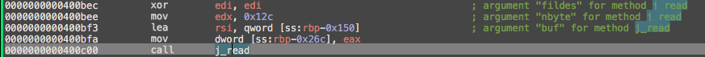
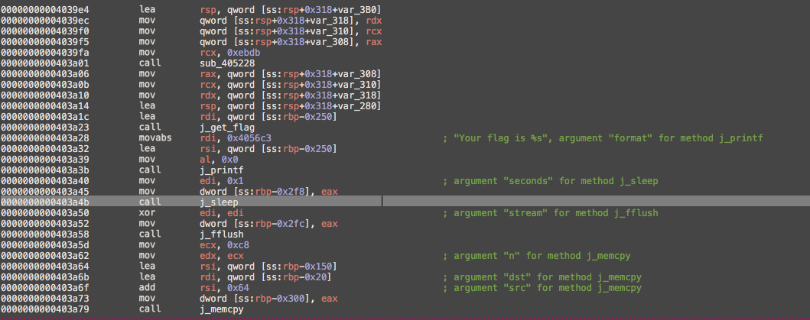
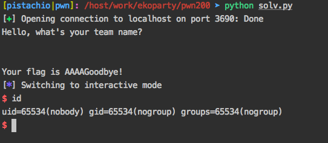

# Fuckzing exploit

###*Category:* Pwn *Points:* 200 *Solved:* 23

>Now that you surpassed the conditions, will you be able to exploit the binary? (conditions from reversing 250)
>
>nc 7e0a98bb084ec0937553472e7aafcf68ff96baf4.ctf.site 10000
>
>Hint
>There is no ASLR now!
>`d443f227870b9c29182cc7a7a007d881 /usr/lib/x86_64-linux-gnu/libc.so.6`
>

## write-up
#### Binary Detail:
```zsh
$ checksec.sh --file FUck_binary                                                                                           1 ↵ [12:25:00]
RELRO           STACK CANARY      NX            PIE             RPATH      RUNPATH      FILE
Partial RELRO   No canary found   NX enabled    No PIE          No RPATH   No RUNPATH   FUck_binary
```
### LANG [EN](#user-content-en)/[TH](#user-content-th)


# TH

> โจทย์นี้เป็นโจทย์ต่อจากข้อ `Fuckzing reverse` ซึ่งในทีนี้จะพูดถึงแค่ส่วนของโจทย์นี้ก่อนเท่านั้น 

ในโปรแกรมนี้นั้นเมื่อทำการ reverse ดูแล้วจะเห็นว่า code นี้ได้มีการรับข้อมูลด้วยคำสั่ง `read(stdin, rbp-0x150, 0x12C)`


และในรูปที่สองจะเห็นได้ว่ามีการทำ `memcpy(rbp-0x20, rbp-0x150+0x64, 0xc8)` ซึ่งจะเห็นได้ชัดเจนว่ามีการเกิด bufferoverflow ขึ้น และจาก binary จะเห็นได้ว่าไม่มี stack canary ป้องกัน
ทำให้เราสามารถทำ ROP Chain ได้เลย และจากโจทย์บอกอีกว่า ASLR Disabled ทำให้เราสามารถ bruteforce หา address ของคำสั่ง system ได้เลยเช่นกัน หรือถ้าไม่ bruteforce ก็สามารถ leak address libc ออกมาได้เลย ซึ่งในที่นี้ได้ใช้วิธีการ leak libc โดยวิธีการนั้นสามารถดูได้ใน code และหลังจากการ reverse จะเห็นว่าก่อนที่จะทำ memcpy ได้นั้นจำเป็นต้องผ่านโจทย์ `Fuckzing reverse` ก่อน.



เนื่องจากตอนที่เขียน write-up นี้โจทย์บนเครื่องเซิฟเวอรได้ปิดไปแล้วจึงยิงเข้าเครื่องตัวเองแทน

# EN

(TODO)
